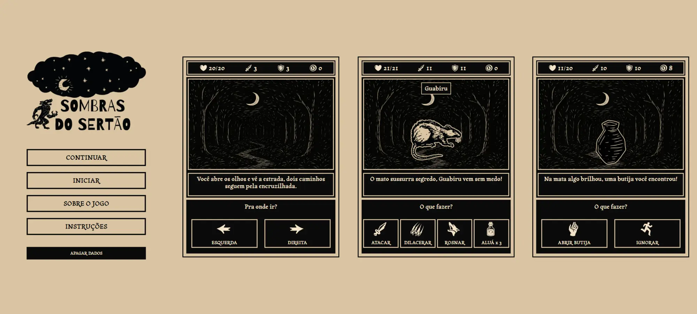

# 🌙 Sombras do Sertão

Um jogo **RPG narrativo em estilo cordel**, inspirado no folclore nordestino.  
O jogador percorre a mata fechada, enfrentando monstros, evitando armadilhas e buscando sobreviver até o **chefe final**.

Feito em **HTML, CSS e JavaScript puro**, sem bibliotecas externas.

---

## 🎮 Como Jogar

1. Abra o `index.html` no navegador. Ou <a href="https://marvieiradev.github.io/game-cordel-rpg/" target="_blank">clique aqui </a>para jogar.
2. Clique ou toque para iniciar.
3. Use os botões da interface para interagir:
   - **ATACAR**: golpe básico com a peixeira.
   - **DILACERAR**: ataque especial mais forte (tem tempo de recarga).
   - **RUGIR**: amedronta o inimigo, reduzindo sua força (tem tempo de recarga).
   - **ALUÁ**: poção que recupera vida.
   - **ESQUERDA/DIREITA**: escolha caminhos na mata.
   - **ABRIR BUTIJA**: colete ouro, poções e melhorias.
   - **DESCANSAR** (em sala segura): recupera vida e salva progresso.
4. Avance até a **sala 50** e derrote o chefe para vencer o jogo.
5. Se morrer, seu personagem recomeça mais forte (sistema **rogue-like**).

---

## ✨ Recursos

- **História interativa** com narrativa rimada.
- **Sistema de salas**:
  - Vazias, com monstros, armadilhas, butijas (baús), seguras e chefes.
  - Geração semi-aleatória, com regras que equilibram a dificuldade.
- **Combate baseado em rolagem de dados**:
  - Críticos, raspões e golpes fortes.
  - Sistema de medo (rugido assusta inimigos).
- **Loot e progressão**:
  - Ouro, aluás (poções), upgrades de ataque, defesa e HP.
  - Itens comuns, raros e lendários.
- **Sistema de salvamento**:
  - Funciona apenas em salas seguras.
  - Usa `localStorage` com criptografia simples (XOR + HEX) para dificultar manipulação.
- **UI e Áudio**:
  - Interface responsiva para PC e mobile.
  - Sons para ataques, poções, baús, rugidos e música ambiente.
- **Estética cordel**:
  - Visual minimalista, inspirado em xilogravuras.
  - Poemas rimados para ambientação.

---

## 🛠️ Tecnologias

- **HTML5** → Estrutura e telas do jogo.
- **CSS3** → Estilo cordel, responsividade e animações.
- **JavaScript (ES6)** → Lógica de jogo, combate, loot, salas e salvamento.
- **LocalStorage** → Sistema de save criptografado.
- **Audio API** → Sons e música.

---

## 🚀 Como Executar

1. Baixe ou clone este repositório.
2. Abra o arquivo `index.html` no navegador.
3. Jogue direto, sem necessidade de servidor ou instalação.

---

## 🖼️ Telas

---

## 📜 Licença

Projeto desenvolvido para a 4° Edição do Concurso FSC.  
Sinta-se livre para usar, modificar e compartilhar.

Ouça também a música que me inspirou na história e tema desse jogo: <a href="https://youtu.be/sNNzt7kSzg4?si=VFuykqDsXrT0I1k0" target="_blank">Décimas Lunares (Seu Pereira e Coletivo 401)</a>

---
